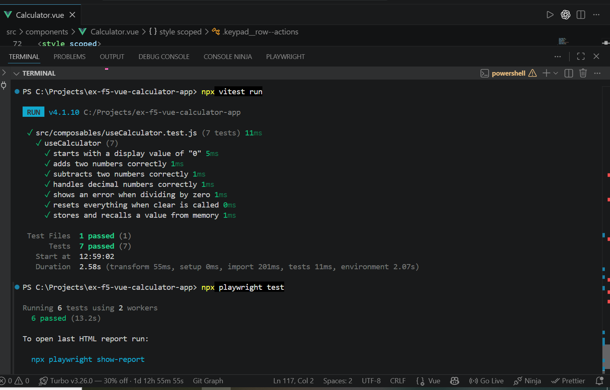

# Vue Calculator App

A multifunctional calculator built with Vue 3, featuring a currency converter and a live weather module, developed as part of the Full Stack Bootcamp.

## Features

### Calculator
- Basic arithmetic operations: addition, subtraction, multiplication, division
- Digit keys (0–9), decimal point, and clear (CE) function
- Division-by-zero error handling
- Memory functions (M+, MR, MC) powered by Pinia

### Currency Converter
- Integrated within the calculator
- Convert between Euro (€), Dollar ($), and Yen (¥)
- Live exchange rates via the [CurrencyFreaks API](https://currencyfreaks.com/)

### Weather Widget
- Live weather data via the [El Tiempo API](https://www.el-tiempo.net/api)
- Toggle between national forecast and Asturias province forecast
- Custom SVG icons mapped to sky condition codes

## Tech Stack

- **Framework:** Vue 3 (Composition API, `<script setup>`)
- **Build Tool:** Vite
- **State Management:** Pinia
- **HTTP Client:** Axios
- **Unit Testing:** Vitest
- **E2E Testing:** Playwright
- **Styling:** Scoped CSS, mobile-first design

## Project Structure

```
src/
├── components/       # Vue components (Calculator, CurrencyConverter, WeatherWidget)
├── composables/      # Reusable logic (useCalculator)
├── stores/           # Pinia stores (memoryStore)
├── services/         # API calls (currencyApi, weatherApi)
├── assets/           # Icons and static assets
└── App.vue           # Root component
```

## Getting Started

### Prerequisites
- Node.js (v18 or higher recommended)
- npm

### Installation

```bash
git clone https://github.com/Raana-1375/ex-f5-vue-calculator-app.git
cd ex-f5-vue-calculator-app
npm install
```

### Environment Variables

Create a `.env` file in the project root with your CurrencyFreaks API key:

```
VITE_CURRENCYFREAKS_API_KEY=your_api_key_here
```

Get a free API key at [currencyfreaks.com](https://currencyfreaks.com/).

### Run the development server

```bash
npm run dev
```

### Run unit tests

```bash
npm run test
```

### Run E2E tests

```bash
npx playwright test
```

### Build for production

```bash
npm run build
```

## Links

- 🔗 [GitHub Repository](https://github.com/Raana-1375/ex-f5-vue-calculator-app)
- 🔗 [Live Demo on GitHub Pages](https://raana-1375.github.io/ex-f5-vue-calculator-app/)

## Architecture Notes

Although this project doesn't use class-based inheritance, it follows a similar separation-of-concerns idea to MVC:

- **Model (logic & data):** `composables/` (calculator logic), `services/` (API calls), `stores/` (Pinia memory state) — no UI code lives here.
- **View (presentation):** `components/*.vue` — templates and styling only; they call into the model layer rather than containing business logic themselves.

This keeps each piece focused on a single responsibility: a component can be restyled or rearranged (as done in this update) without touching calculation logic, API calls, or state — and vice versa.

## Author
Raana
Developed as part of the Full Stack Bootcamp (Vue 3 module).


